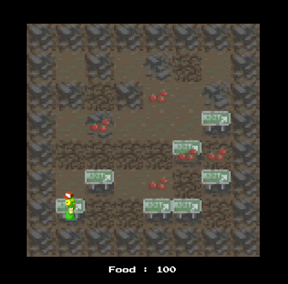

# 2D Roguelike Game (Unity)

Throughout development, this project focuses on:
- Organizing and prioritizing tasks
- Understanding complex programming concepts
- Working with pixel art inside Unity
- Building scalable game systems

By the end, i will have a fully functioning game that can be expanded and customized.

---

## 🎮 Core Features

### 🧱 Procedural Game Board
- Randomly generated tile-based game board on start
- Border system that traps the player within the game area
- Custom scripted Tilemap system

---

### 👤 Player System
- PlayerCharacter GameObject created from provided assets
- Proper rendering layer configuration to ensure visibility
- Custom `PlayerController` script:
  - Handles player movement
  - Processes user input
  - Integrates with turn system

---

### 🔄 Turn Management
- `TurnManager` script tracks:
  - Each player movement
  - Turn count progression
- Reworked initialization logic to support turn-based mechanics

---

### 🍎 Resource System (Food Mechanic)
- Food resource spawns randomly at game start
- Player can collect food items
- Food decreases with every turn
- Food increases when collected

This introduces survival-based gameplay mechanics.

---

### 🖥 User Interface
- UI built using Unity UI Builder
- In-game label displays:
  - Current food amount
- Real-time updates tied to gameplay events

---

## 🛠 Technologies Used

- Unity
- C#
- Tilemap System
- Unity UI Builder
- Pixel Art Assets

---

## 🚀 Future Improvements

- Enemy AI
- Combat system
- Procedural level scaling
- Inventory system
- Sound effects and music

---

## 📌 Project Goal

To build a modular, expandable 2D Roguelike framework that demonstrates clean architecture, turn-based mechanics, and resource-driven gameplay.
